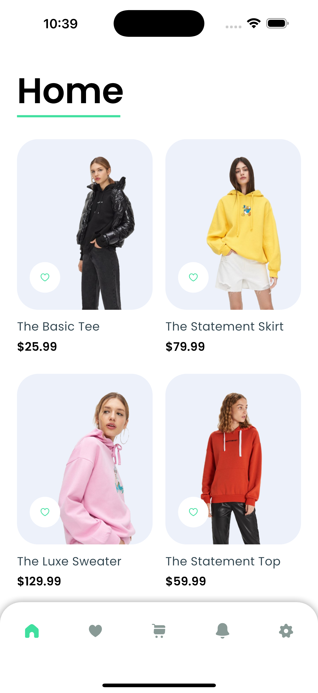
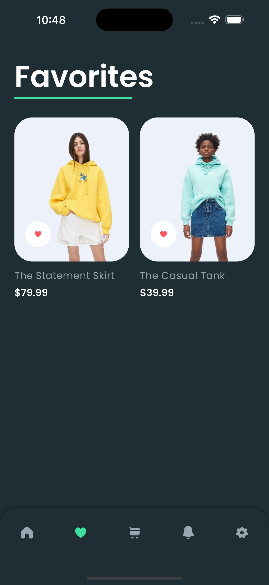
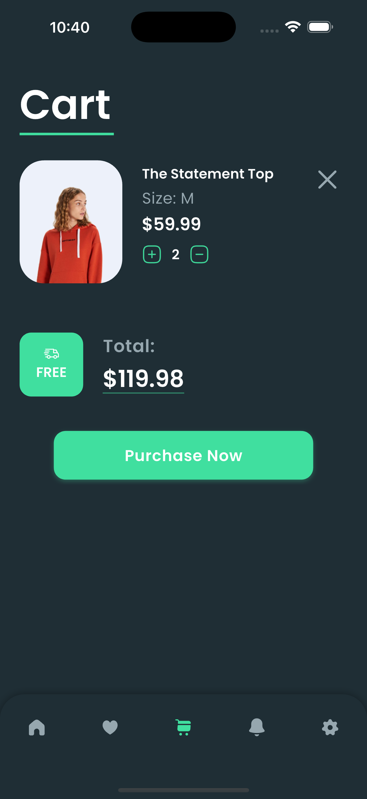
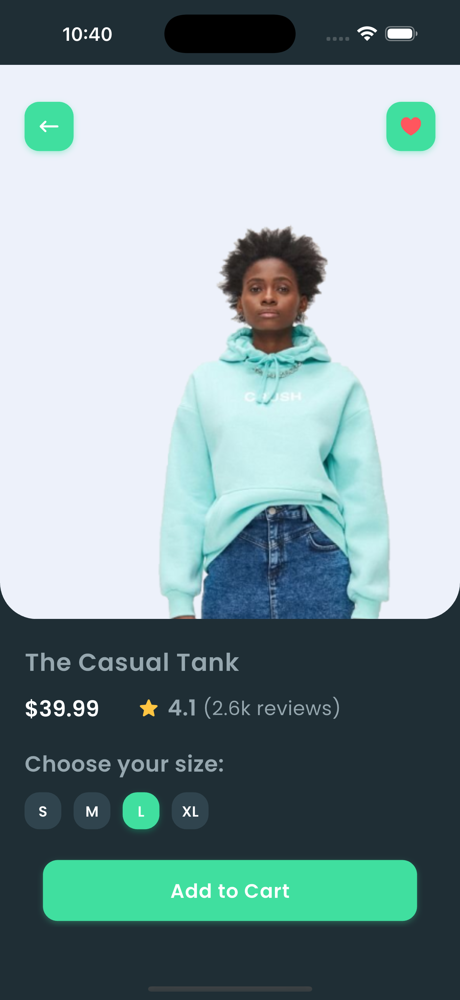
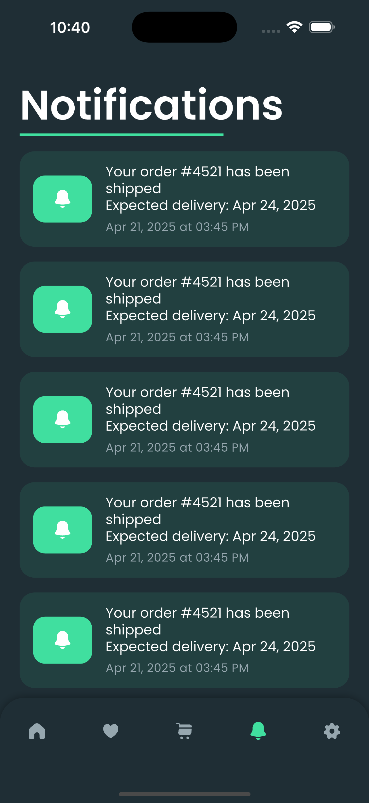
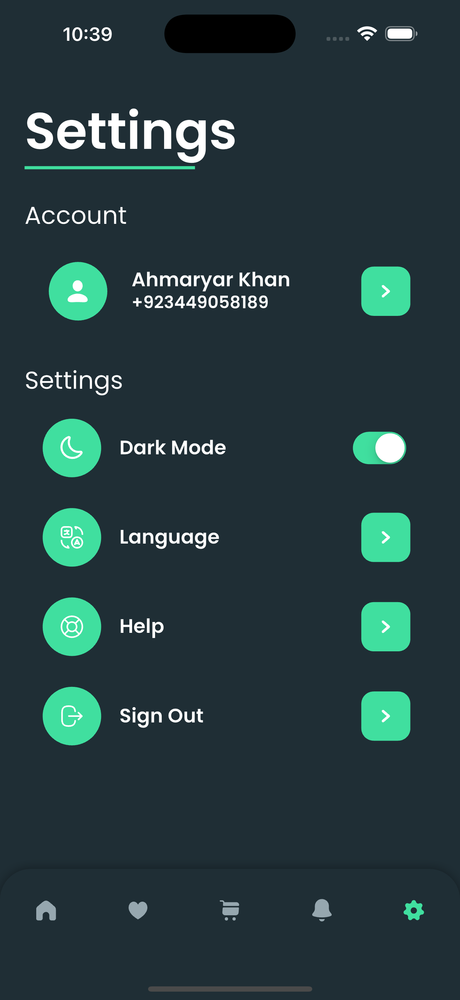

# 🛍️ Flutter E-commerce App by Ahmaryar Khan

A beautifully designed e-commerce app built using **Flutter** and **GetX**, featuring a smooth and responsive UI optimized for online shopping experiences.

> 🚀 Developed as part of my Flutter internship project with custom UI and functionality enhancements.

---

## 📸 Screenshots

<table>
  <tr>
    <td align="center"><b>🏠 Home</b></td>
    <td align="center"><b>❤️ Favorites</b></td>
  </tr>
  <tr>
    <td></td>
    <td></td>
  </tr>
</table>

 

<table>
  <tr>
    <td align="center"><b>🛒 Cart</b></td>
    <td align="center"><b>ℹ️ Product Details</b></td>
  </tr>
  <tr>
    <td></td>
    <td></td>
  </tr>
</table>

 

<table>
  <tr>
    <td align="center"><b>🔔 Notifications</b></td>
    <td align="center"><b>⚙️ Settings</b></td>
  </tr>
  <tr>
    <td></td>
    <td></td>
  </tr>
</table>

---

## 📙 Overview

This Flutter E-commerce UI provides a ready-to-use template for online shopping apps. With features like theme toggling, favorite management, and cart functionality, this app gives a solid foundation for any mobile shopping experience.

---

## 🧩 Features

- 🛍️ Browse latest products  
- ❤️ Add/remove products to/from favorites  
- 🛒 Add/remove items in the cart  
- ℹ️ View product details  
- 🔔 Notification panel  
- 🌙 Dark theme support  

---

## 📦 Dependencies

- [`get`](https://pub.dev/packages/get) – State management & navigation  
- [`flutter_screenutil`](https://pub.dev/packages/flutter_screenutil) – Responsive layout support  
- [`shared_preferences`](https://pub.dev/packages/shared_preferences) – Local storage  
- [`flutter_animate`](https://pub.dev/packages/flutter_animate) – Animations  
- [`flutter_svg`](https://pub.dev/packages/flutter_svg) – SVG icon support  

---

## 🔗 Inspiration & Credits

- Original UI concept from [Marvie iOS App UI Kit](https://dribbble.com/shots/10904459-Marvie-iOS-App-UI-Kit-Dark-Theme) by [Toma](https://dribbble.com/WastingMyTime)  

---

## 💌 Contact

If you have feedback or suggestions, feel free to connect with me:

- 📧 Email: codexahmar@gmail.com  
- 💼 LinkedIn: [Ahmaryar Khan](https://www.linkedin.com/in/ahmaryarkhan)

---

## 🌟 Don’t forget to star the repository if you like it!
